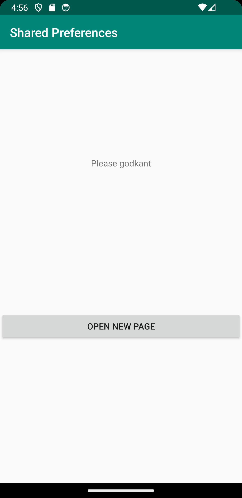
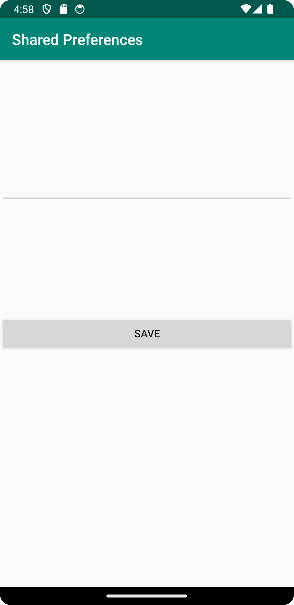
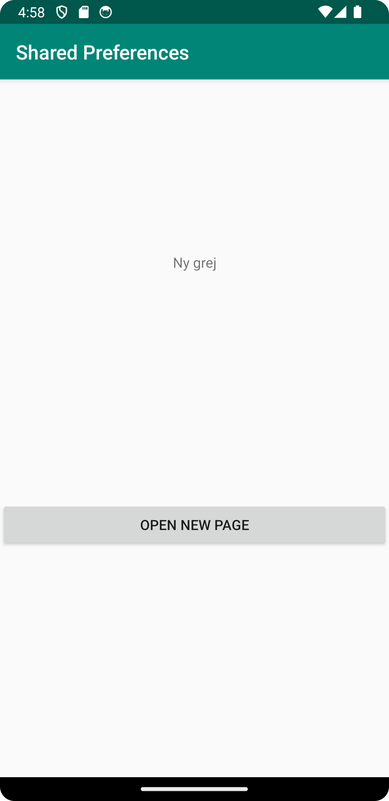

# Rapport

**Skriv din rapport här!**

_Du kan ta bort all text som finns sedan tidigare_.

## Följande grundsyn gäller dugga-svar:

- Jag började med att skapa en ny activity och la in En button text och editText views
- Jag la till en knapp i main som startade denna nya activity MainActivity2
- I MainActivity och MainActivity2 intialiserade jag en SharedPreference så båda activities kunde dela preferences
```
    myPreferenceRef = getSharedPreferences("MyCookiePreferences", MODE_PRIVATE);
    myPreferenceEditor = myPreferenceRef.edit();
``` 
- I MainActivity2 gjorde jag så att det som skrevs i editText viewen sparades som preferens och att andra aktiviteten stängdes ner
```
   myPreferenceEditor.putString("MyAppPreferenceString", newPrefText.getText().toString());
   myPreferenceEditor.apply();
```
- I MainActivity i onResume displayade jag texten så att den uppdaterades när man sparat i andra aktiviteten
 
```
protected void onResume() {
    prefTextRef = (TextView)findViewById(R.id.prefTextMain);
    prefTextRef.setText(myPreferenceRef.getString("MyAppPreferenceString", "No preference found"));
    
    super.onResume();
}
 ```
      
,,

